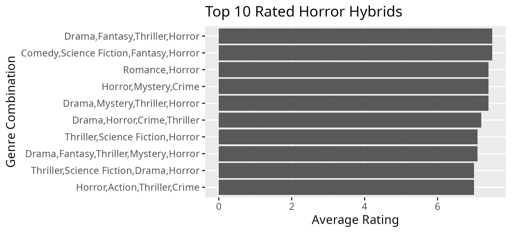
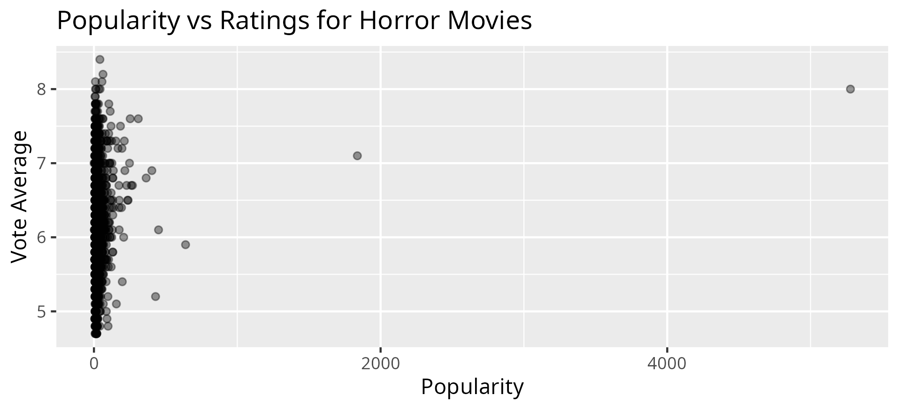

## Horror Movie Analysis 
Analyzing what makes horror movies (including subgenres) successful using SQL, R, and Tableau. 

# 🧟‍♀️ Project Overview
This project explores what makes a horror movie successful using data from TMDB. 
I analyzed trends in ratings, popularity, and audience engagement to understand how different factors influence a film's success. 
#❓ Key Question 
What makes a horror movie successful? 

# 🛠️ Tools Used 
- Google Sheets: data cleaning & exploration 
- SQL: CSVFiddle for querying 
- R: analysis & visualization 
- Tableau: interactive dashboard

# 📊 Key Insights 
- Horror movies have an average rating of around 6.2, suggesting moderate audience reception overall.
- Genre combinations such as Horror + Mystery + Sci-Fi tend to recieve higher ratings.
- Popularity does not always equal quality—some highly discussed films are not the highest rated.
- Classic horror films still perform strongly in both ratings and engagement.

📈 Visualizations 

# 📌 Tableau Dashboard 
[View Interactive Dashboard](https://public.tableau.com/views/WhatMakesaHorrorMovieSuccessful/HorrorMoviesDashboard?:language=en-US&:sid=&:redirect=auth&:display_count=n&:origin=viz_share_link)

# 💡 Conclusion
Horror movies tend to perform better when they blend with other genres like mystery or science fiction. While popular films generate attention, they are not the most critically acclaimed. 

# 👩🏻‍💻 Author: China Trimble 
